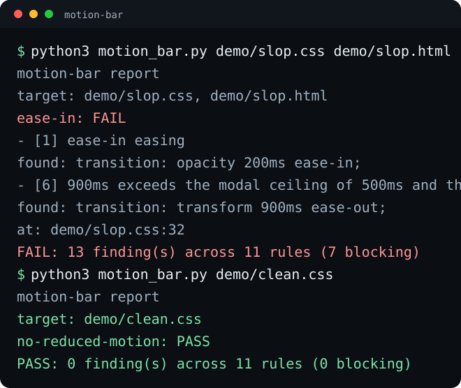

# motion-bar

Motion is the first thing a page gets wrong and the last thing anyone reviews. motion-bar is a static scan of UI code for the violations a reviewer would flag: durations past the ceiling, the wrong easing for the gesture, animation on things people trigger a hundred times a day. Named rules, exit codes for CI, no browser.




## Quick start

Install it and scan a directory:

```bash
pipx install git+https://github.com/eliferres/motion-bar
motion-bar src/
```

The default rules ship with the install, so a scan works from any
directory. Or clone the repo and run it against the demo files:

```bash
git clone https://github.com/eliferres/motion-bar.git
cd motion-bar
python3 -m motion_bar demo/clean.css
python3 -m motion_bar demo/slop.css demo/slop.html
```

Zero dependencies, Python 3.9+, no network needed. `demo/clean.css`
clears every rule and exits 0. `demo/slop.css` and `demo/slop.html`
plant six violations on purpose; the actual run trips eleven rules,
because a planted violation can overlap another rule's check, for
13 findings in total, and exit 1.

## The walkthrough

Run the failing pair:

```bash
python3 -m motion_bar demo/slop.css demo/slop.html
```

Each rule prints its own PASS/WARN/FAIL block, with the exact string
that tripped it:

```text
motion-bar report
target: demo/slop.css, demo/slop.html

ease-in: FAIL
  - [1] ease-in easing
      found: transition: opacity 200ms ease-in;
      at:    demo/slop.css:6

duration-ceiling: FAIL
  - [6] 900ms exceeds the modal ceiling of 500ms and the 700ms hard ceiling
      found: transition: transform 900ms ease-out;
      at:    demo/slop.css:32

FAIL: 13 finding(s) across 11 rules (7 blocking)
```

Now the clean file:

```bash
python3 -m motion_bar demo/clean.css
echo "exit: $?"
```

`PASS: 0 finding(s) across 11 rules (0 blocking)`, exit 0. Add `--json`
for CI or a dashboard:

```bash
python3 -m motion_bar demo/slop.css --json
```

Scan whatever changed instead of walking the whole tree by passing a
newline-separated file list:

```bash
git diff --name-only origin/main...HEAD > /tmp/changed.txt
python3 -m motion_bar --changed /tmp/changed.txt
```

## The rules

Every ceiling and selector list below lives in `motion_bar/rules.json`, not
in the code, so grading a different codebase means editing numbers, not
regexes.

| # | Rule | Why | Source |
|---|---|---|---|
| 1 | `ease-in` | the curve is at its slowest at the instant the interface should be responding, so the gap between the click and the first visible movement reads as lag | duration/easing table |
| 2 | `transition-all` | `all` transitions whatever property changes later too, including ones nobody chose to animate, so the visual effect drifts as the rule it sits in is edited | performance |
| 3 | `scale-zero` | collapsing to a single point before growing reads as an object appearing out of nowhere rather than moving or expanding into place; 0.9 and up still reads as the same element, just smaller | physicality |
| 4 | `scale-zero-prop` | the same collapse-to-a-point problem as scale-zero, just written through the standalone `scale` property instead of a `transform` value, so the scanner needs its own check for it | physicality |
| 5 | `layout-prop` | width, height, margin, padding, and offset properties force the browser to recompute the position of surrounding elements on every frame, which is where dropped frames under load come from | performance |
| 6 | `duration-ceiling` | controls people reach for many times an hour need a shorter animation than ones seen once in a while, because the wait accumulates across every use; each ceiling marks where a longer value starts reading as a stall instead of motion | duration table |
| 7 | `linear-easing` | constant-speed motion (a marquee, a progress fill) never speeds up or slows down toward an endpoint, so a flat, unchanging rate is the only one that matches it; anything with a start and a finish looks mechanical at a flat rate | easing table |
| 8 | `high-frequency-animation` | an interaction that happens well over a hundred times in a session turns even a short animation into real cumulative waiting time, so cutting the animation outperforms shortening it | frequency table |
| 9 | `infinite-loop` | a loop with no stop condition matches a state with no known end time, which only a loading indicator has; anywhere else it reads as a process stuck running forever | frequency table |
| 10 | `framer-shorthand` | Framer Motion's `x`/`y`/`scale` props are recalculated in JavaScript on every animation frame instead of being handed off to the compositor, so they compete with the page's other script work for frame time | performance |
| 11 | `no-reduced-motion` | nothing in the scanned files checks the OS-level setting a viewer uses to ask for less motion, so that viewer gets the same animation as everyone else regardless of what they asked their system for | accessibility |

Four rules block, which is what makes a rule report FAIL rather than
WARN: `ease-in`, `transition-all`, `scale-zero`, and
`high-frequency-animation`. `duration-ceiling` blocks only when the
duration is past the hard ceiling in `motion_bar/rules.json`; every
other rule warns. Any finding, blocking or not, exits 1.

Rules informed by Emil Kowalski's published animation guidance
(github.com/emilkowalski/skills, MIT License; see `NOTICE`).

## Wiring it into CI

```yaml
- name: motion-bar
  run: python3 -m motion_bar src/
```

Exit 1 fails the job. Point it at a diff instead of the whole tree with
`--changed`, or add `--json` to feed a dashboard.

## Limitations

- Static text scan only. Nothing is rendered, computed styles and
  CSS-in-JS produced at runtime are invisible, and a page can pass here
  and still animate badly in a browser.
- Kind and allowlist matching (which ceiling applies, whether linear or
  an infinite loop is expected) reads the nearest enclosing selector or
  a text window around the match, not a real parse tree. A class name
  chosen well can dodge a rule it should trip, and an unrelated keyword
  sitting nearby can trip one it should not.
- A hand-rolled ease-in-shaped `cubic-bezier()` passes; only the literal
  `ease-in` keyword and easing name are checked.
- Font, motion, and selector matching is keyword-based against the
  lists in `motion_bar/rules.json`. A codebase with different naming
  conventions needs its own list, not a different tool.

## License

MIT
